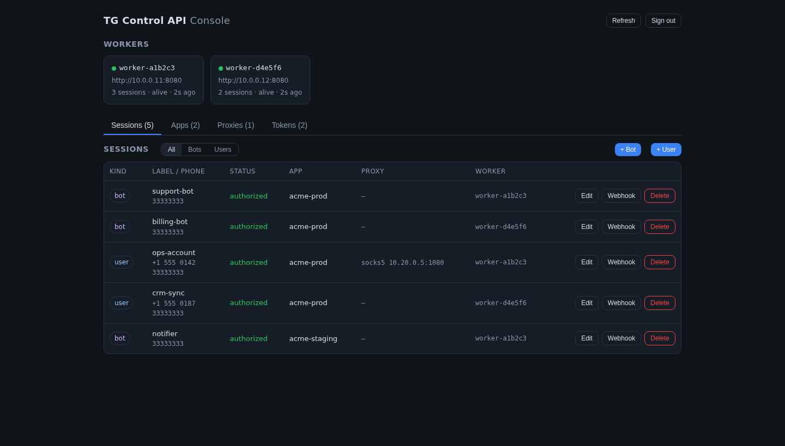
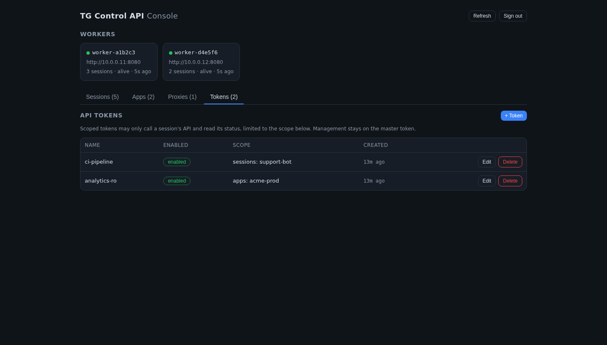

# Telegram Control API Server

[](https://github.com/FINWAX/tg-control-api-server/actions/workflows/ci.yml)

A containerized internal service that exposes an HTTP interface to Telegram
**user accounts** (like TelegramApiServer) and **bots** (like the tdlight Bot
API) over a single engine — TDLib. Credentials, session persistence, and
authorization are all handled server-side. Aimed at self-hosted deployments of
**under ~50 accounts**.

The public surface is native td_api JSON: you send a method name plus params and
the service dispatches it on the right session. User and bot sessions never mix.

## Management console

An optional web console (Next.js served by Caddy) manages sessions, apps,
proxies, workers, and scoped API tokens — no curl required. Enable it with the
`ui` compose profile (see [Running](#running)).



Scoped API tokens grant per-session or per-app access, separate from the master
token:



## Architecture

Two planes, split into separate containers:

- **gateway** (`cmd/gateway`) — stateless control plane. Holds no TDLib clients.
  Terminates auth, serves registry reads/writes straight from Postgres, and
  reverse-proxies session-scoped requests to the worker that owns the session.
- **worker** (`cmd/worker`) — data plane. Owns live TDLib clients (one per
  account), drives login, delivers update webhooks, and claims orphaned sessions
  from the registry. Horizontally scalable; see [Scaling workers](#scaling-workers).

Supporting pieces: **Postgres** is the registry and ownership lease (apps,
proxies, sessions, workers, webhook deliveries, API tokens). Secrets
(api_hash, bot tokens, proxy passwords, session DB keys) are encrypted with
AES-256-GCM using a master key from the environment and never leave the service
in plaintext. Each account gets its own TDLib database directory, and each session
can run through its own dedicated proxy (optional, but supported per session so up
to ~50 accounts can each present from a distinct IP).

```
client ──HTTP──> gateway ──reverse-proxy──> worker ──CGO──> libtdjson ──> Telegram
                    │                          │
                    └────────── Postgres ──────┘   (registry + ownership lease)
```

Internals: `internal/api` (worker HTTP surface), `internal/router` (gateway
routing + auth), `internal/session` (worker manager + authorizer + reconciler),
`internal/store` (Postgres), `internal/secret` (AES-GCM), `internal/tdjson`
(raw td_api JSON dispatch).

## Prerequisites

- Docker + Docker Compose.
- No local Go/Node toolchain needed — everything builds in containers.

Pinned versions (do not drift): go-tdlib `v1.0.0-beta1` against image
`ghcr.io/zelenin/tdlib-docker:b498497-alpine` (TDLib `b498497`).

## Setup

```sh
cp .env.example .env
# Fill in .env — both values are `openssl rand -base64 32`:
#   MASTER_KEY  — AES-256 key for the secret store
#   API_TOKEN   — master bearer token for the gateway API
```

`.env` holds infra config only and is gitignored. Tenant credentials
(api_id/api_hash, bot tokens, phones, proxies) are **never** put in env — they
are sent to the API and stored encrypted in Postgres.

Postgres credentials are read from `POSTGRES_USER` / `POSTGRES_PASSWORD` /
`POSTGRES_DB` (dev-only defaults apply when unset); the `DATABASE_URL` the
services use is composed from them. Set them in `.env` for anything but local
development.

## Running

```sh
docker compose up -d --build          # gateway + postgres + workers
docker compose logs -f gateway        # follow logs
docker compose down                   # stop (volumes kept)
docker compose down -v                # stop and wipe data
```

Optional management console (Next.js served by Caddy, reverse-proxying the API):

```sh
docker compose --profile ui up -d     # console on http://localhost:3080
```

Sign in with the master `API_TOKEN`. The console manages sessions, apps, proxies,
workers, and scoped tokens without hand-rolling curl.

Toolchain smoke test:

```sh
docker build -t tg-control-api-server . && docker run --rm tg-control-api-server ./smoke
```

The gateway and workers expose a `/healthz` liveness endpoint and ship with
Compose healthchecks, so `docker compose ps` reflects real readiness and the
console only starts once the gateway is healthy.

## Quickstart

With the stack up, point at the gateway and set your master token:

```sh
export G=http://localhost:8080
export TOKEN=<your API_TOKEN from .env>
```

**1. Register a Telegram app** (get `api_id`/`api_hash` from <https://my.telegram.org>):

```sh
curl -s "$G/v1/apps" -H "Authorization: Bearer $TOKEN" \
  -d '{"api_id":123456,"api_hash":"...","label":"main"}'        # -> {app_id}
```

**2. Register a proxy** (optional, one per session recommended for user accounts):

```sh
curl -s "$G/v1/proxies" -H "Authorization: Bearer $TOKEN" \
  -d '{"type":"socks5","host":"1.2.3.4","port":1080,"username":"u","password":"p"}'  # -> {proxy_id}
```

**3. Create a session.** A **bot** logs in non-interactively:

```sh
curl -s "$G/v1/bot" -H "Authorization: Bearer $TOKEN" \
  -d '{"token":"<bot_token>","app_id":"<app_id>","proxy_id":"<proxy_id>"}'   # -> {id, status:authorized, me}
```

A **user** needs the login code (and the 2FA password if set):

```sh
curl -s "$G/v1/user" -H "Authorization: Bearer $TOKEN" \
  -d '{"app_id":"<app_id>","phone":"+1555...","proxy_id":"<proxy_id>"}'       # -> {id, status:awaiting_code}
curl -s "$G/v1/user/<id>/login/code"     -H "Authorization: Bearer $TOKEN" -d '{"code":"12345"}'
curl -s "$G/v1/user/<id>/login/password" -H "Authorization: Bearer $TOKEN" -d '{"password":"..."}'   # only if 2FA
```

Save the session `id` as `$SID`.

**4. Call any td_api method** on the session — the method name is resolved
dynamically, so the full td_api surface is available:

```sh
curl -s "$G/v1/bot/$SID/call" -H "Authorization: Bearer $TOKEN" \
  -d '{"method":"getMe","params":{}}'          # user sessions use /v1/user/$SID/call
```

**5. Receive updates** (new messages, etc.) by subscribing a webhook:

```sh
curl -s -X PUT "$G/v1/bot/$SID/updates/webhook" -H "Authorization: Bearer $TOKEN" \
  -d '{"url":"https://your-app/telegram","secret":"...","filters":{"types":["updateNewMessage"]}}'
```

From here: [send media](#sending-files), [download / crawl](#downloading-files-crawling),
issue [scoped tokens](#api-tokens), or drive it all from the
[console](#management-console).

## Data and upgrades

State lives in two named volumes: `pgdata` (the Postgres registry — apps,
proxies, sessions, tokens, encrypted secrets) and `tdlibdata` (per-account TDLib
databases). Both persist across `up`/`down` and image rebuilds; `down -v` wipes
them.

The database schema is **versioned and migrated automatically** on startup:
each release applies only the migrations newer than what the database already
has, in order, once each (tracked in `schema_migration`, serialized across
gateway/workers by an advisory lock). Migrations are forward-only and additive,
so upgrading to a newer image never drops or rewrites existing data — just
`docker compose pull && docker compose up -d`.

**Do not bind-mount `pgdata` / `tdlibdata` to a Windows or macOS drive** under
Docker Desktop. TDLib's binlog and Postgres rely on POSIX atomic-rename and
locking, which the Windows/macOS file-sharing bridge does not provide — it
causes fatal binlog-rename crashes in the workers and can corrupt Postgres. Use
named volumes (they live on the Linux VM's filesystem) and, if you need a
host-path copy for portability or backup, export them on a schedule with
`pg_dump` and `tar` rather than binding the live data. Bind mounts to a **native
Linux path** are fine.

## Development

Unit tests link libtdjson (CGO), so they run inside the build image rather than
on the host:

```sh
./scripts/test.sh              # unit tests (go test ./...) in the toolchain image
./scripts/test-integration.sh  # Postgres-backed store tests against a throwaway DB
./scripts/footprint.sh         # measure per-account memory / disk of a running stack
```

## API

Every request except `GET /healthz` must carry `Authorization: Bearer <token>`.

| Method & path | Purpose |
| --- | --- |
| `GET  /healthz` | Liveness (no auth) |
| `POST /v1/apps` `{api_id, api_hash, label}` | Register a Telegram app → `{app_id}` |
| `POST /v1/proxies` `{type, host, port, username?, password?, secret?, label?}` | Register a proxy → `{proxy_id}` |
| `POST /v1/bot` `{token, app_id, proxy_id?, label?}` | Create + log in a bot → `{id, status, me}` |
| `POST /v1/user` `{app_id, phone, proxy_id?, label?}` | Start a user login → `{id, status}` |
| `POST /v1/user/{id}/login/code` `{code}` | Submit the login code |
| `POST /v1/user/{id}/login/password` `{password}` | Submit the 2FA password |
| `POST /v1/{user\|bot}/{id}/call` `{method, params}` | Async td_api call on the session |
| `POST /v1/execute` `{method, params}` | Synchronous td_api call (no session) |
| `POST /v1/files?name=` | Upload a file → `{path}` (single-shot; see [Sending files](#sending-files)) |
| `PATCH/GET /v1/files/{id}`, `POST /v1/files/{id}/complete`, `DELETE /v1/files/{id}` | Resumable/chunked upload |
| `GET /v1/{user\|bot}/{id}/files/{file_id}` | Download a file, streamed with Range (see [Downloading files](#downloading-files-crawling)) |
| `PUT/DELETE /v1/{user\|bot}/{id}/updates/webhook` | Manage update delivery |
| `GET  /v1/{user\|bot}/{id}` | Session status |
| `PATCH /v1/{user\|bot}/{id}` `{label?, proxy_id?}` | Rename / change proxy (applied live) |
| `DELETE /v1/{user\|bot}/{id}` | Close and remove a session |
| `GET  /v1/{sessions\|apps\|proxies\|workers}` | Registry listings (no secrets) |
| `PATCH /v1/{apps\|proxies}/{id}` `{label}` | Rename |
| `GET/POST/PATCH/DELETE /v1/tokens` | Scoped API token CRUD |

### Response envelope

Success is `{"ok": true, "result": ...}`. Failure is:

```jsonc
{"ok": false, "error": {
  "message": "Chat not found",  // human-readable, from TDLib or this service
  "source": "tdlib",            // "tdlib" = Telegram refused; "gateway" = this service
  "code": 400,                  // TDLib error code — present only when source is "tdlib"
  "retry_after": 30             // seconds; only on FLOOD_WAIT (code 420), also sent as Retry-After
}}
```

`source` is the field to branch on: `"gateway"` means the request never reached
Telegram (bad input, unknown session, no live worker) and is often retryable as
is; `"tdlib"` means Telegram itself rejected it. The HTTP status mirrors `code`
for TDLib errors, with `420` (FLOOD_WAIT) mapped to `429`.

Note that TDLib packs most refusals into `code: 400` regardless of cause, so
distinguishing e.g. *Chat not found* from *CHANNEL_PRIVATE* still requires
matching on `message`. Waits and infrastructure failures, which is where retry
decisions actually matter, are covered by `retry_after` and `source`.

### Choosing `/call` vs `/execute`

`POST /v1/{user|bot}/{id}/call` reaches **every** td_api method — including the
synchronous ones such as `parseTextEntities`, which work fine on a live session —
except those the gateway reserves for itself (session lifecycle, authentication,
proxy, and logging methods; they answer `403`).

`POST /v1/execute` is `td_execute`: local computation with no session and no
account state, for the ~28 synchronous methods only. Reach for it when no session
exists yet — otherwise just use `/call`. Both accept scoped tokens.

### Addressing chats

`chat_id` accepts either a username (`"@my_channel"`, resolved via
`searchPublicChat`) or a numeric id — private chat, basic group, or the familiar
`-100…` supergroup/channel form.

TDLib lazy-loads dialogs, so a valid numeric id can answer *Chat not found* until
something materializes the chat object. `/call` handles that for you: on that
error it decodes the peer type from the id, force-loads the chat
(`createPrivateChat` / `createBasicGroupChat` / `createSupergroupChat`) and
retries once. Clients do not need to know the id encoding or warm chats up.

This works when the account already holds the peer's access hash — it is a member
of the chat, or has seen it. A never-seen **private** channel cannot be reached
from its numeric id alone (a Telegram protocol constraint); join it, or address a
public one by `@username`.

## Sending files

TDLib sends media from a **file on the owning worker's disk** (`inputFileLocal`),
never as bytes inline in a `/call`. To make that work as a pure HTTP API, upload
the file first: the gateway writes it to a volume shared with the workers, and
the owning worker reads it back locally — so the bytes cross the network once
(client → gateway), not again to the worker.

**Small/medium files — single-shot:**

```sh
curl -sX POST "$G/v1/files?name=pic.jpg" -H "Authorization: Bearer $TOKEN" \
     --data-binary @pic.jpg
# -> { "ok": true, "result": { "path": "/uploads/<id>/pic.jpg", "size": 12345 } }
```

Then reference the returned `path`:

```sh
curl -sX POST "$G/v1/bot/$SID/call" -H "Authorization: Bearer $TOKEN" -d '{
  "method": "sendMessage",
  "params": { "chat_id": "@my_channel", "input_message_content": {
    "@type": "inputMessagePhoto",
    "photo": { "@type": "inputFileLocal", "path": "/uploads/<id>/pic.jpg" }
  }}}'
```

**Large files (up to 2 GiB) — resumable/chunked** (survives network drops):

1. `POST /v1/files?name=movie.mp4` with header `Upload-Length: <bytes>` → `{upload_id, chunk_size}`
2. `PATCH /v1/files/<upload_id>` with header `Upload-Offset: <n>` and a chunk body, repeatedly
3. `GET /v1/files/<upload_id>` → `{offset}` to resume after an interruption
4. `POST /v1/files/<upload_id>/complete` → `{path}` (verifies the full length)

`PATCH` answers with the **new absolute offset** — the total bytes now on disk,
not the size of the chunk just sent — as `{"offset": n}` and in an `Upload-Offset`
response header. Send the next chunk from that value. A `PATCH` whose
`Upload-Offset` doesn't match the current end of the file is rejected with `409`
rather than written out of order: re-read `GET /v1/files/<upload_id>` and resume
from the offset it reports.

**By URL (no upload):** pass `{"@type":"inputFileRemote","id":"https://…"}` as the
file and TDLib fetches it directly.

Uploaded files are single-use: reuse the same media across chats via the Telegram
`remote` file id returned in the first send (`inputFileRemote`), not the local
file. A file is removed as soon as its send completes; anything never sent is
swept after `UPLOAD_TTL` (default 2h). `inputFileLocal` paths are confined to the
uploads volume — a `/call` cannot reference any other path on the worker.

Filenames keep their real name (the upload id lives in the directory, not the
filename), capped at the filesystem's 255-byte limit; Telegram truncates long
document names on its side.

## Downloading files (crawling)

Incoming media is referenced by a `file` object on the message: a local `id`
(ephemeral, this session run), `remote.id` (a persistent reference), and
`remote.unique_id` (a stable content fingerprint — the dedup key). Discover
messages with `getChatHistory` / `searchChatMessages` (or in real time via the
update webhook), then download.

Stream a file straight from the owning worker's disk, with HTTP `Range` support:

```sh
# by the local file id from a message
curl -s "$G/v1/user/$SID/files/1234" -H "Authorization: Bearer $TOKEN" -o out.jpg

# by the persistent remote id (works later / after a restart, no live file_id)
curl -s "$G/v1/user/$SID/files/0?remote_id=<remote_id>" \
     -H "Authorization: Bearer $TOKEN" -o out.jpg

# add &delete=1 to drop the file from TDLib storage after a full download
```

The download is synchronous (it blocks until TDLib has the whole file) and the
bytes stream back — no base64. `Range` requests return `206 Partial Content`, so
a large download can resume. For a crawl, persist `remote.id` (to re-fetch) and
`remote.unique_id` (to skip duplicates); if a `remote.id` ever returns *file
reference expired*, re-read the source message to refresh it. Bound disk during a
crawl with `?delete=1`, or `deleteFile` / `optimizeStorage` via `/call`.

The lower-level td_api path also works directly through `/call` (`downloadFile`
→ `readFilePart`), but returns bytes as base64 in JSON — the streaming endpoint
above is preferred for anything but small files.

## API tokens

The `API_TOKEN` from env is the **master** token: full admin access.

Additional **scoped** tokens can be created (via `/v1/tokens` or the console).
A scoped token may invoke a session's `/call`, read its status, and download its
files — only for sessions its scope covers. Scope is the union of:

- `all_sessions` — every session, or
- an explicit `session_ids` list, or
- `app_ids` — all sessions belonging to those apps.

Three routes are open to any enabled token regardless of scope: file uploads
(`/v1/files*`, which only become sendable through a session's `/call`),
`/v1/execute` (local computation touching no session), and `GET /v1/sessions`,
which is **filtered to the token's own grants** — so an integrator can discover
the full session ids and kinds it may address without being handed the master
token. Everything else (apps, proxies, tokens, session lifecycle) is master-only.

Each token has an `enabled` flag. Only the SHA-256 of a token's secret is stored;
the plaintext is shown once at creation.

## Scaling workers

Workers are stateless with respect to identity — each registers itself and the
reconciler rebalances sessions to a fair share (`ceil(total / live workers)`).
Set the count in `docker-compose.yml` (`deploy.replicas`) or override at runtime:

```sh
docker compose up -d --scale worker=4
```

Minimum one worker. Killing a worker (graceful or hard) fails its sessions over
to peers within seconds. All replicas share the `tdlibdata` volume, so this
assumes a single host; spreading across hosts would need shared storage.

## Requirements and resource footprint

The service is light: at the target scale (**under ~50 accounts, single host**)
host resources are not the binding constraint — Telegram's per-account rate
limits and proxy throughput are. Footprint is **linear in the number of
accounts**, and you can re-measure any running stack with
[`scripts/footprint.sh`](scripts/footprint.sh).

Measured baseline (idle containers, RSS):

| Component | Memory | Notes |
| --- | --- | --- |
| gateway | ~6 MiB | stateless, holds no TDLib clients |
| postgres | ~40 MiB | registry; grows slowly (KiB per account) |
| worker (base) | ~15 MiB | Go + libtdjson, before any session |
| ui (optional) | ~12 MiB | Caddy + static export |

Per account, on top of the worker base:

| Account type | Memory (RSS) | Disk (tdlibdata) |
| --- | --- | --- |
| **bot** | ~2–4 MiB | ~0.1 MiB |
| **user** | ~10–15 MiB | a few MiB, grows with the file cache |

User sessions are heavier and their disk grows as TDLib caches downloaded media
(message/chat databases are disabled by default; the file database is on — tune
in `buildParams`, [internal/session/manager.go](internal/session/manager.go)).
The `uploads` volume is transient: it holds in-flight uploads (up to
`MAX_UPLOAD_BYTES`, default 2 GiB, each) and is cleaned on send completion and by
the TTL sweep.

**Recommended host** for up to ~50 accounts on one machine:

- **CPU:** 1–2 vCPU (idle < 1%; brief spikes only during media transfer).
- **RAM:** 1 GiB minimum, 2 GiB comfortable — covers Postgres plus an
  all-user worst case (~50 × 15 MiB ≈ 0.75 GiB of clients) with headroom.
- **Disk:** 10–20 GiB — Postgres is small; the rest is the TDLib file cache and
  transient uploads. Size up if you push large media through the `uploads`
  volume concurrently.

To grow past one host, add workers (they scale linearly), but note the shared
`tdlibdata`/`uploads` volumes assume a single host — see [Scaling
workers](#scaling-workers).

## Observability

OpenTelemetry is built in and opt-in. Set `OTEL_EXPORTER_OTLP_ENDPOINT` (plus any
standard `OTEL_*` variables) on the gateway and workers to export **traces,
metrics, and logs** over OTLP to any collector:

- **Traces** span each request end to end, from the gateway into the owning
  worker (context is propagated on the reverse-proxy hop).
- **Metrics** are HTTP server/client metrics from `otelhttp`.
- **Logs** — every `log` line is teed to OTLP while still printing to stdout
  (Docker logs), so nothing is lost.

With no endpoint configured, telemetry is disabled and the service just logs to
stdout.

## Deploying to production

The compose defaults are for local development. Before a real deployment:

- **Strong secrets.** Generate fresh `MASTER_KEY` and `API_TOKEN`
  (`openssl rand -base64 32` each), and set real `POSTGRES_USER` /
  `POSTGRES_PASSWORD` / `POSTGRES_DB` — don't ship the `tgapi:tgapi` default.
- **Clean database.** Start on fresh volumes; don't carry over a development
  `pgdata` (it holds test sessions and their secrets).
- **TLS and a private network.** The API is a bearer token over plain HTTP —
  terminate TLS in front of the gateway (reverse proxy) for anything but a
  trusted private network. Workers are unauthenticated **by design**: never
  publish their ports; only the gateway (and optionally the console) should be
  reachable.
- **Disk headroom** for the TDLib file cache and the transient `uploads` volume
  — see [Requirements](#requirements-and-resource-footprint).

Upgrades are `docker compose pull && docker compose up -d`: schema migrations
apply automatically and are forward-only, so existing data is preserved (see
[Data and upgrades](#data-and-upgrades)).

## License

Apache License 2.0 — see [LICENSE](LICENSE) and [NOTICE](NOTICE).
Contributions welcome; see [CONTRIBUTING.md](CONTRIBUTING.md).
